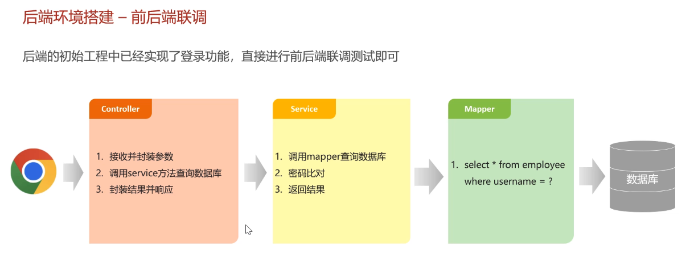
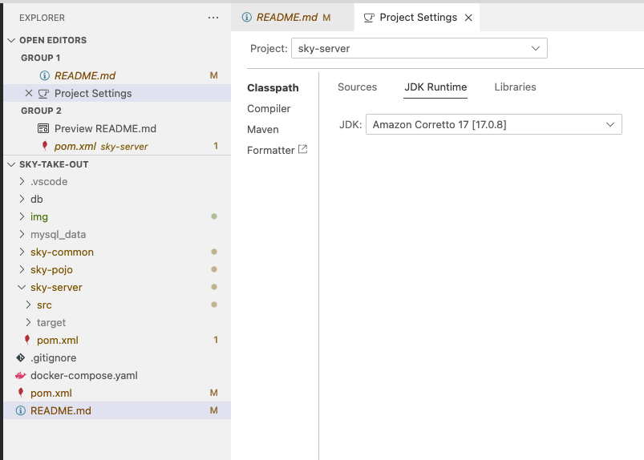

## Front-end

1. download nginx:`brew install nginx`
2. download front-end code: [sky-take-out-frontend](https://github.com/weitianpaxi/sky_take_out/blob/main/sky_take_out%E7%AE%A1%E7%90%86%E7%AB%AF%E5%89%8D%E7%AB%AF%E8%BF%90%E8%A1%8C%E7%8E%AF%E5%A2%83.zip), and unzip file and get `前端运行环境`
3. copy `sky` folder, in front-end code, into nginx folder `/opt/homebrew/var/www`. (`brew info nginx` -> `Docroot is: /opt/homebrew/var/www`)
4. copy nginx.conf from `/前端运行环境/nginx-1.20.2/conf`, and replace the original nginx.conf in `/opt/homebrew/etc/nginx` (`brew info nginx`, and look for address like `/opt/homebrew/etc/nginx/nginx.conf`). I change the ports number to as below:

   ```bash
    worker_processes  1;

    events {
        worker_connections  1024;
    }

    http {
        include       mime.types;
        default_type  application/octet-stream;

        sendfile        on;

        keepalive_timeout  65;

      map $http_upgrade $connection_upgrade{
        default upgrade;
        '' close;
      }

      upstream webservers{
        server 127.0.0.1:8082 weight=90 ;
      }

        server {
            listen       8081; # avoid: wechat 8080, docker 80
            server_name  localhost;

            location / {
                root   html/sky;
                index  index.html index.htm;
            }

            error_page   500 502 503 504  /50x.html;
            location = /50x.html {
                root   html;
            }

            # 反向代理,处理管理端发送的请求
            location /api/ {
          proxy_pass   http://localhost:8082/admin/;
            }

        # 反向代理,处理用户端发送的请求
            location /user/ {
                proxy_pass   http://webservers/user/;
            }

        # WebSocket
        location /ws/ {
                proxy_pass   http://webservers/ws/;
          proxy_http_version 1.1;
          proxy_read_timeout 3600s;
          proxy_set_header Upgrade $http_upgrade;
          proxy_set_header Connection "$connection_upgrade";
            }
        }
    }
   ```

5. run `brew services start nginx`, and visit `localhost` in browser. To stop nginx, run `brew services stop nginx`
6. Done

Reference:

1. https://blog.csdn.net/m0_74570541/article/details/133352659
2. https://blog.csdn.net/qq_45828494/article/details/131982807
3. https://github.com/weitianpaxi/sky_take_out/tree/main

## Local Development Setup

1. Copy `.env.example` to `.env`
2. Fill in your actual credentials in `.env`

## Database

The schema is provided in `sky.sql`. All actual data lives in a temporary Docker volume, so you can delete it at will.

Follow the steps below to bring up a database for local development, seed it with demo data, and tear it down again.

```python
# start all services (includes service `db`) defined in the docker-compose.yml
docker compose -f docker-compose.yaml up -d

# view the logs of the db service defined in your docker-compose.yml
docker compose logs -f db

# inside the db container, creates the database and loads all data.
docker compose exec -T db \
  mysql -u root -p123456 < db/sky.sql # no space between -p and secret!
#  • `docker compose exec db …` → “find the container for service ‘db’ (i.e. sky-mysql) and run … inside it.”
#  • `mysql -u root -p123456` → launch the MySQL CLI as root, with password 123456.
#  • `< db/sky.sql` → on your Mac, read the file `db/sky.sql` and send it into that CLI’s stdin.
#  Because sky.sql’s first lines say “CREATE DATABASE IF NOT EXISTS sky_take_out; USE sky_take_out; …”,
#  MySQL will create the database and load all tables + seed data in one shot.

# use database `sky_take_out`
docker compose exec db \
  mysql -u root -p123456 sky_take_out
```

Then run sql query:

```sql
mysql> SHOW TABLES;
mysql> select * from employee;
```

Other command to restart/re-create a db container:

```
# remove/create container
docker compose -f docker-compose.yaml down
docker compose -f docker-compose.yaml up -d

# pause/start container
docker compose -f docker-compose.yaml stop
docker compose -f docker-compose.yaml start
```

## Compile

run `mvn clean compile` to compile the project.

## Visit the web app

`http://localhost:8081/`

## Notes



I use Java 17 to compile and build. In my IDE (i use VSCode), i change the JDK runtime (command palette -> Java: Configure Java Runtime) to `Amazon Corretto 17 [17.0.8]` as below:


### check swagger documentation

visit `http://localhost:8082/doc.html` (use the same port in `sky-server/src/main/resources/application.yml`)

### ThreadLocal

every request is handle by the same thread.
intercepter, controller, service works in the same thread for each request, so if intercept store the id info in threadlocal, this `id` can be read by `service`.
ThreadLocal 并不是一个 Thread，而是 Thread 的局部变量。ThreadLocal 为每个线程提供单独一份存储空间，具有线程隔离的效果，只有在线程内才能获取到对应的值，线程外则不能访问。
